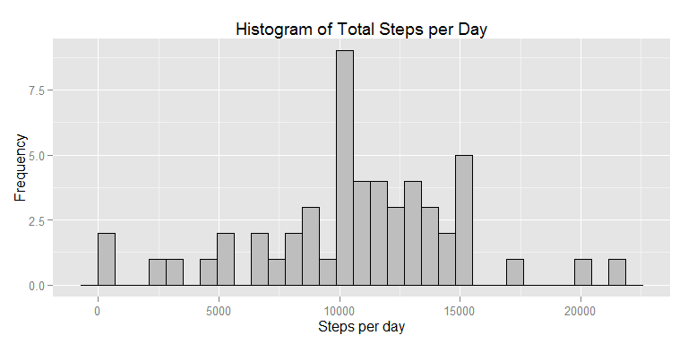
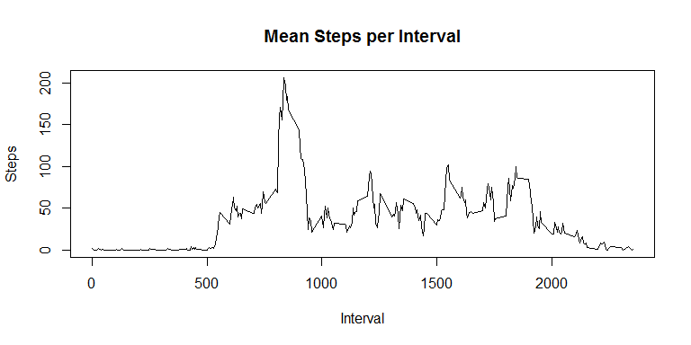
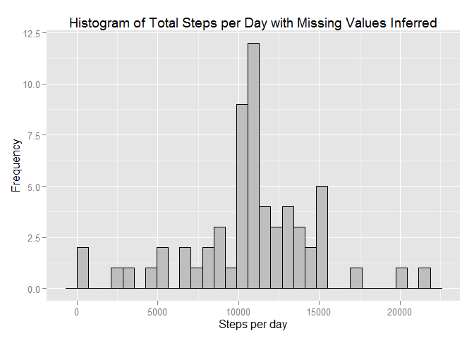
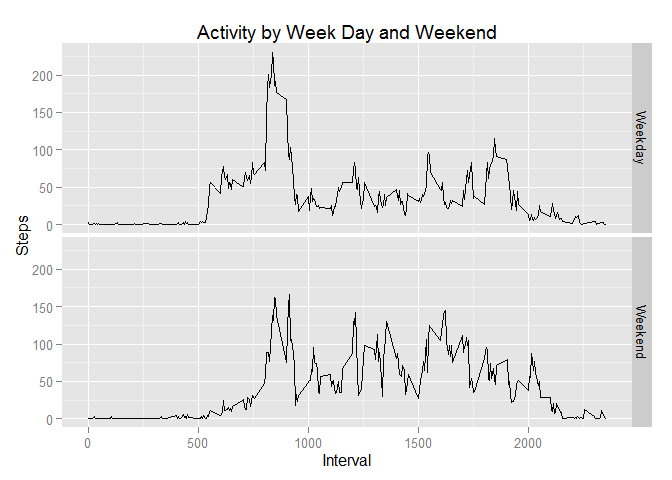

# Reproducible Research: Peer Assessment 1

## Loading and preprocessing the data

```r
library(ggplot2)
library(plyr)
unzip("./activity.zip") 
raw.activity <- read.csv("./activity.csv")
```
###For this part of the assignment, you can ignore the missing values in the dataset

```r
activity <- raw.activity[complete.cases(raw.activity),]  
```

## What is mean total number of steps taken per day?

###1.Make a histogram of the total number of steps taken each day

```r
steps <- tapply(activity$steps, activity$date, sum)
qplot(steps) + geom_histogram(colour="black", fill="grey") + 
  labs(x="Steps per day", y="Frequency", title="Histogram of Total Steps per Day")
```

 

###2.Calculate and report the mean and median total number of steps taken per day

```r
mean.steps <- mean(steps, na.rm=TRUE)
median.steps <- median(steps, na.rm=TRUE)
```

The mean number of total steps per day is **1.0766189\times 10^{4}** and the median
is **10765**.


## What is the average daily activity pattern?


The daily activity pattern averaged within each five minute interval across all
days:

```r
avg.int <- ddply(activity, "interval", summarise,
                        steps=mean(steps, na.rm=TRUE))
plot(avg.int,type="l",main="Mean Steps per Interval", xlab = "Interval", ylab = "Steps")
```

 

```r
maxint <- which.max(avg.int$steps)
```

The interval with the maximum number of steps when averaged across all days is
**interval **.

## Imputing missing values

```r
narows <- raw.activity[!complete.cases(raw.activity),]
rowcount <- nrow(narows)
daycount <- unique(narows$date)
```
There are **2304** rows with NAs in the dataset across **2012-10-01, 2012-10-08, 2012-11-01, 2012-11-04, 2012-11-09, 2012-11-10, 2012-11-14, 2012-11-30**

Replace missing values with the average for that interval on the missing days


```r
infna <- merge(narows[, c("date", "interval")], avg.int, by = "interval")
infact <- rbind(activity,infna)
steps <- tapply(infact$steps, infact$date, sum)
qplot(steps) + geom_histogram(colour="black", fill="grey") + 
  labs(x="Steps per day", y="Frequency", title="Histogram of Total Steps per Day with Missing Values Inferred")
```

 

```r
mean.steps <- mean(steps, na.rm=TRUE)
median.steps <- median(steps, na.rm=TRUE)
```
The mean number of total steps per day is **1.0766189\times 10^{4}** and the median
is **1.0766189\times 10^{4}** so although graphically there is no significant difference using inferred data the mean andf median have changed.


## Are there differences in activity patterns between weekdays and weekends?


```r
infact$weekday <- factor(weekdays(as.Date(infact$date)),
                       levels=c("Sunday", "Monday", "Tuesday", "Wednesday",
                                "Thursday", "Friday", "Saturday"))

day.type <- factor(infact$weekday %in% c("Saturday","Sunday"))
infact$day.type <- mapvalues(day.type, from=c("FALSE", "TRUE"), to=c("Weekday", "Weekend"))

weekday.avg.int <- ddply(infact, .(interval, day.type), summarise, steps=mean(steps, na.rm=TRUE))

ggplot(weekday.avg.int, aes(interval, steps)) + geom_line() + facet_grid(day.type ~ .) +
    labs(x="Interval", y="Steps", title="Activity by Week Day and Weekend")
```

 

There are differences in activity between the weekend daya and the week days with the weekend activity starting later and finishing later in the day.
